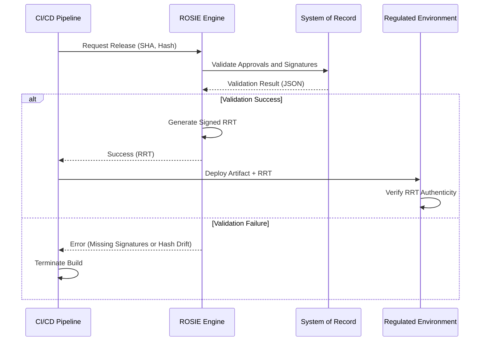

# RFC-002: ROSIE Engine Specification ("Integrity Guard" and Sync)

## Metadata

| Field   | Value                                                                   |
| ------- | ----------------------------------------------------------------------- |
| RFC ID  | 002                                                                     |
| Title   | ROSIE Engine: Functional Requirements for GxP Sync and Validation Tools |
| Version | 1.1.0                                                                   |
| Status  | Draft                                                                   |
| Focus   | Tool qualification, release gates, sync logic, SoR interface            |

## 1. Scope

This RFC defines the functional requirements for the ROSIE Engine, the automated software orchestrator responsible for extracting RFC-001 data, maintaining Dual-Ledger synchronization with a System of Record (SoR), and enforcing regulatory gates within the CI/CD pipeline.

### 1.1 ROSIE Engine responsibilities

The engine is responsible for:

- Parsing repositories to extract `@gxp-` annotations (RFC-001)
- Building and validating the trace graph
- Computing deterministic manifest hashes
- Communicating with the SoR via the API contract (RFC-004)
- Enforcing release gates in CI/CD pipelines
- Generating evidence packages (RFC-003)

### 1.2 System of Record responsibilities (out of scope)

The SoR is a separate system—commercial or custom—that implements RFC-004. The SoR is responsible for:

- User authentication and authorization
- Approval workflows (sequential, parallel, role-based)
- Electronic signature capture (21 CFR Part 11 compliant)
- Audit trail storage and retention
- Notification and escalation

ROSIE defines the *interface* to the SoR, not the SoR implementation itself.

### 1.3 Implementation flexibility

This specification is **platform-agnostic**. Compliant engines may be implemented as:

- CLI tools
- CI/CD plugins (GitHub Actions, GitLab CI, Jenkins, Azure DevOps, etc.)
- IDE extensions
- Standalone services

Key management, secret storage, and cryptographic implementations are environment-specific and outside this specification. Implementers must select appropriate solutions for their security requirements (e.g., HSM, Vault, cloud KMS, local keychain).

## 2. Sync protocol (Dual-Ledger)

The engine must maintain state consistency between the Git repository (design intent) and the SoR (regulatory approval).

### 2.1 Ingest logic (repo -> SoR)

- Extraction: Scan the repository at every PR or commit to build a directed acyclic graph (DAG) of requirements and annotations.
- Diff detection: Identify new, modified, or deleted `@gxp-` blocks and push these proposed changes to the SoR.
- Versioning: Associate every sync event with a unique Git commit SHA.

### 2.2 Reflect logic (SoR -> repo)

- Metadata injection: Pull approval statuses, timestamps, and e-signatures into the YAML front matter of corresponding `.md` files.
- Non-destructive write: Update only designated metadata fields, never altering requirement narrative text or implementation code.

### 2.3 Audit trail requirements

Every transaction performed by the engine must be logged in an immutable audit trail within the SoR, containing:

- `user_id` (or `agent_id` for automated tasks)
- `timestamp` (UTC)
- `action_type` (e.g., `INGEST`, `REFLECT`, `HASH_VERIFY`)
- `payload_hash` (SHA-256 of the exchanged data)

## 3. Data integrity (the Integrity Guard)

### 3.1 The manifest hash

The engine must compute a cumulative SHA-256 hash of the entire validation state.

- Input: Concatenation of all `@gxp-id`, `@gxp-traces`, and the text content of linked requirements.
- Storage: The manifest hash is stored in the SoR as the canonical fingerprint of the validated version.
- Validation: Any change to code or specs during the release cycle results in a hash mismatch, automatically revoking Approved status.

### 3.2 Pre-commit enforcement

To prevent shadow documentation (manual edits to approved metadata), the engine provides a client-side hook:

- Mechanism: Compare local metadata blocks against the last known sync state from the SoR.
- Enforcement: Reject commits if `status: Approved` is found in a modified block without a valid SoR-signed sync token.

## 4. AI agent protocol (optional)

Engines MAY implement AI-assisted features to enhance auditability and accelerate legacy retrofitting. This section defines the protocol for engines that choose to include AI capabilities.

> **Note:** AI features are optional enhancements. A fully compliant ROSIE engine can operate without any AI components.

### 4.1 Semantic consistency check (optional)

If implemented:

- Logic: Compute vector embeddings for requirement text and the implemented code block.
- Alerting: If cosine similarity falls below a configurable threshold (default: 0.75), flag the trace for manual review.
- Model selection: Implementation-specific. May use local models, cloud APIs, or custom embeddings.

### 4.2 Shadow mode retrofitting (optional)

If implemented:

- Restricted access: AI is forbidden from writing directly to `.md` or source files during initial discovery.
- Proposal file: AI generates `gxp-proposal.json` containing recommended tags and links.
- Acceptance: A human developer must apply the proposal, at which point the engine performs the injection and logs the action as AI-assisted traceability.

### 4.3 AI provenance requirements

If AI features are used, any AI-generated content MUST be tagged:

```yaml
provenance: "ai-inferred"
ai_model: "model-identifier"
ai_confidence: 0.85
inferred_at: "2026-02-01T10:00:00Z"
```

AI-inferred traces cannot satisfy approval requirements until promoted to `provenance: "human-verified"` by a qualified user in the SoR.

## 5. Automated release gates (Hard-Gate)

The engine acts as a blocking gate in the CI/CD pipeline (e.g., GitHub Actions, Jenkins).

### 5.1 Gate logic (RRT protocol)

The engine evaluates the following expression before allowing a build to proceed to a regulated environment:

`G = (S_all AND H_match AND T_pass)`

Where:

- `S_all`: All identified IDs in the PR have Approved status in the SoR.
- `H_match`: The current manifest hash matches the SoR-signed hash.
- `T_pass`: All verification nodes (OQ/PQ) associated with the change have passed execution.

### 5.2 Release Readiness Token (RRT)

If `G` is true, the engine generates a short-lived, cryptographically signed RRT. Deployment scripts must verify this token before deploying artifacts.

### 5.3 RRT structure

The RRT is a signed payload containing:

```json
{
  "rrt_version": "1.0",
  "product_code": "LDPC",
  "product_version": "2.1.0",
  "commit_sha": "abc123def456",
  "manifest_hash": "sha256:...",
  "sor_instance": "nexus-qms-prod",
  "issued_at": "2026-02-01T10:00:00Z",
  "expires_at": "2026-02-01T22:00:00Z",
  "composition": [
    {
      "product_code": "LDA",
      "version": "1.5.2",
      "rrt_hash": "sha256:..."
    }
  ]
}
```

### 5.4 RRT field reference

| Field | Required | Description |
|-------|----------|-------------|
| `rrt_version` | Yes | RRT schema version |
| `product_code` | Yes | Product identifier from manifest |
| `product_version` | Yes | SemVer version being released |
| `commit_sha` | Yes | Git commit SHA |
| `manifest_hash` | Yes | Hash of the validated trace graph |
| `sor_instance` | Yes | Identifier of the approving SoR |
| `issued_at` | Yes | ISO-8601 timestamp of issuance |
| `expires_at` | Yes | ISO-8601 timestamp of expiry |
| `composition` | No | Array of sub-product RRT references |

### 5.5 RRT signing

The RRT payload is signed using the SoR's private key. Signature algorithm and key management are implementation-specific but MUST support verification without network access to the SoR (i.e., public key can be cached or distributed).

Recommended algorithms: RS256, ES256, EdDSA.

## 6. Tool qualification (TQ) and GAMP 5 compliance

To be fit for purpose in a GxP environment, the ROSIE Engine must satisfy qualification requirements.

### 6.1 Operational qualification (OQ) for the engine

- Extraction accuracy: Test against a golden repository to ensure 100% accuracy in tag extraction across all supported languages.
- Failure modes: Verify that the engine correctly fails the Hard-Gate when signatures are missing or hashes are tampered with.

### 6.2 AI reliability (the non-deterministic guard)

- Source tagging: Any trace or metadata generated by AI must be explicitly tagged with provenance: `ai-inferred`.
- Human-in-the-loop (HITL): AI-inferred traces cannot satisfy `S_all` until promoted to provenance: `human-verified` by a qualified user.

## Appendix: Sequence diagram (Hard-Gate handshake)


